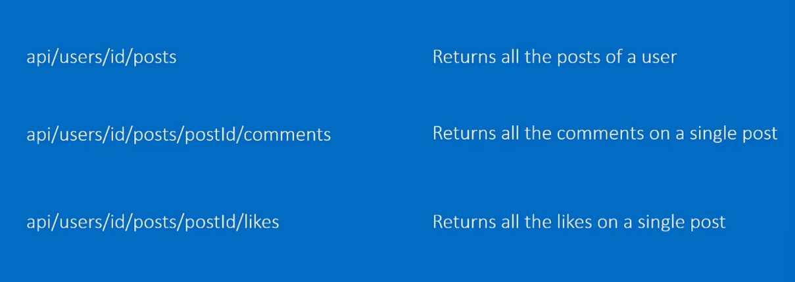
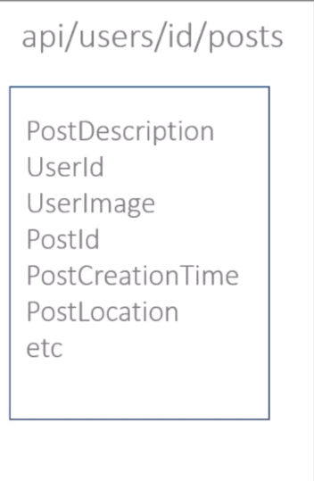
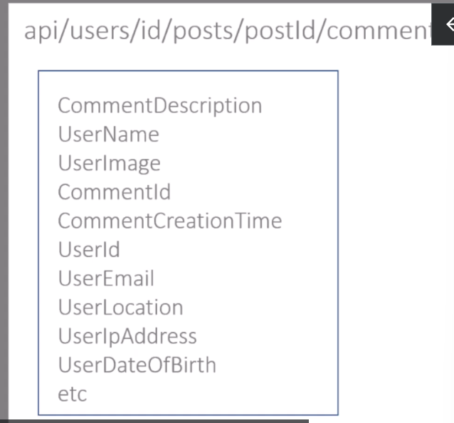
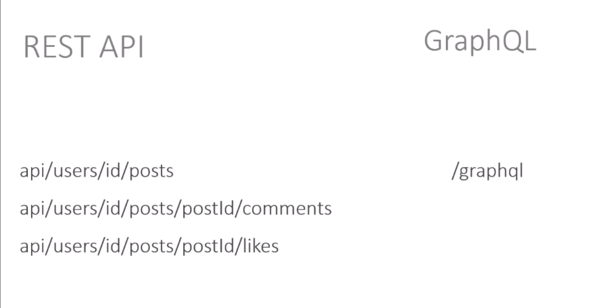
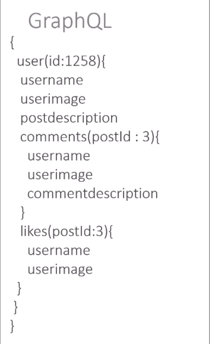
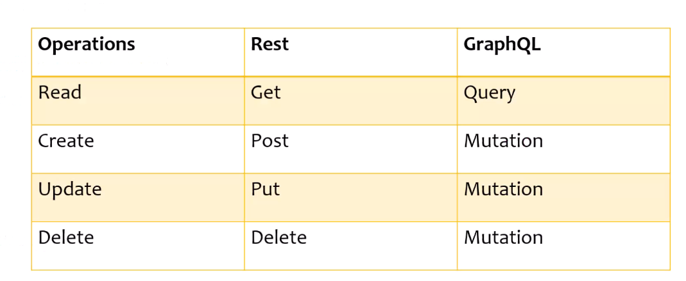

# GraphQL with .Net Core
Using Graph QL with .NET Core

## What is Graph QL? 
- A query language to construct and retrieve data from APIs 
- Invented by Facebook in 2012 
- Open sourced in 2015 
- lot of companies now use it.
- Language and Platform Independent, just has to support JSON 

## Why we need GraphQL? How does it compare to REST 
- Solves the problem of underfetching and overfetching.
- Lets say we want to get all posts of a user, comments on user posts and likes on user posts 
- We will have APIs like this 
- 
- We can see that to get data for a single post including comments and likes we need 3 endpoints.
- This is called under-fetching because a single endpoint will not return all the data. 
- Over-fetching means to get extra data which is not required. 
- 
- 
- We dont need all these fields and they just increase JSON payload size. 
- 
- In GraphQL we just need one single endpoint to get all the results. 
- In the GraphQL query we will pass the userId and we will specify what kind of data we want to retrieve from the server. 
- 
- Now there is no need 3 different requests to fetch the data. We can get all the results in one go. 
- Think of facebook, why they invented GraphQL, they wanted to overcome underfetching and overfetching of data.
- GraphQL is not a replacement of REST. 
- When the project scope is bigger use GraphQL, otherwise use REST. 
- For simple APIs, REST works fine but for complex data, GraphQL really helps.

## Graph QL Query 
- A GraphQL query is used to read or fetch data. 
- In REST APIs we use GET but GraphQL uses Queries. 
```c#
query MyFirstQuery {
  viewer{
    id
    name
    avatarUrl
    login
    createdAt
  }
}

```
- To pass arguments in GraphQL queries use this 
```c#
query {
  repository(name:"graphql" owner:"facebook"){
    createdAt
    id
    description
  }
}

```
## Working with GraphQL Schema
- When we developer creates a GraphQL API, they also define a schema for the GraphQL 
- When the developer runs the GraphQL server, the GraphQL schema is generated.
- This schema provides information about the fields, their descriptions, the types they belong to and the arguments required for querying.
- GraphQL schema is like API Documentation.
- Graph QL contains 2 main root types: query and mutation. 
- Query is used for querying the data and mutation is used for adding, updating or deleting the data.
- We can use GraphQL schema to construct queries. 

## Using Aliases in GraphQL 
- Allow us to retrieve specific data from specific fields by assigning them user friendly names. 
```c#
query {
  dotnetcoreRepo: repository(name:"core" owner:"dotnet"){
    createdAt
    id
    description
  } 
  wpfrepo: repository(name:"wpf" owner:"dotnet"){
    createdAt
    id
    description
  }
}


```
## Creating Fragments in GraphQL 
- Allow us to create reusable set of fields which we can use in our query.
```c#
query {
  dotnetcoreRepo: repository(name:"core" owner:"dotnet"){
    ... RepositoryCommonFields
  } 
  wpfrepo: repository(name:"wpf" owner:"dotnet"){
    ... RepositoryCommonFields
  }
}

fragment RepositoryCommonFields on Repository{
  createdAt
  id
  description
  url
}


```

## Using Variables in GraphQL queries 
- We will pass dynamic values using variables to make our queries more flexible 
- Here $name, $owner is the name of our variables and we can pass variables to our query.
  ```c#
  query DotNetRepo($name:String! $owner:String!) {
  repository(name:$name owner:$owner){
    id 
    createdAt
    description
    url
        }
    }

  ```

  ## Modifying Data with Mutations 
  - Mutations are responsible for creating, updating and deleting the data 
  - 
  ```c#
    mutation AddProject($input:CreateProjectInput!){
    createProject(input:$input){
        clientMutationId
        project{
        id
        createdAt
        url
        }
    }
    }

  ```
  - We can specify variables like this 
  ```c#
  {
	"input":{
    "ownerId": "U_kgDOBY34TA",
    "name": "MyFirstGraphQLProject",
    "body": "First project via mutation",
    "clientMutationId": "123456789"
  }
}

  ```
  