# GraphQL with .Net Core
Using Graph QL with .NET Core

## What is Graph QL? 
- A query language to construct and retrieve data from APIs 
- Invented by Facebook in 2012 
- Open sourced in 2015 
- lot of companies now use it.
- Language and Platform Independent, just has to support JSON 

## Why we need GraphQL? How does it compare to REST 
- Solves the problem of underfetching and overfetching.
- Lets say we want to get all posts of a user, comments on user posts and likes on user posts 
- We will have APIs like this 
- 
- We can see that to get data for a single post including comments and likes we need 3 endpoints.
- This is called under-fetching because a single endpoint will not return all the data. 
- Over-fetching means to get extra data which is not required. 
- 
- 
- We dont need all these fields and they just increase JSON payload size. 
- 
- In GraphQL we just need one single endpoint to get all the results. 
- In the GraphQL query we will pass the userId and we will specify what kind of data we want to retrieve from the server. 
- 
- Now there is no need 3 different requests to fetch the data. We can get all the results in one go. 
- Think of facebook, why they invented GraphQL, they wanted to overcome underfetching and overfetching of data.
- GraphQL is not a replacement of REST. 
- When the project scope is bigger use GraphQL, otherwise use REST. 
- For simple APIs, REST works fine but for complex data, GraphQL really helps.

## Graph QL Query 
- A GraphQL query is used to read or fetch data. 
- In REST APIs we use GET but GraphQL uses Queries. 
```c#
query MyFirstQuery {
  viewer{
    id
    name
    avatarUrl
    login
    createdAt
  }
}

```
- To pass arguments in GraphQL queries use this 
```c#
query {
  repository(name:"graphql" owner:"facebook"){
    createdAt
    id
    description
  }
}

```
## Working with GraphQL Schema
- When we developer creates a GraphQL API, they also define a schema for the GraphQL 
- When the developer runs the GraphQL server, the GraphQL schema is generated.
- This schema provides information about the fields, their descriptions, the types they belong to and the arguments required for querying.
- GraphQL schema is like API Documentation.
- Graph QL contains 2 main root types: query and mutation. 
- Query is used for querying the data and mutation is used for adding, updating or deleting the data.
- We can use GraphQL schema to construct queries. 

## Using Aliases in GraphQL 
- Allow us to retrieve specific data from specific fields by assigning them user friendly names. 
```c#
query {
  dotnetcoreRepo: repository(name:"core" owner:"dotnet"){
    createdAt
    id
    description
  } 
  wpfrepo: repository(name:"wpf" owner:"dotnet"){
    createdAt
    id
    description
  }
}


```
## Creating Fragments in GraphQL 
- Allow us to create reusable set of fields which we can use in our query.
```c#
query {
  dotnetcoreRepo: repository(name:"core" owner:"dotnet"){
    ... RepositoryCommonFields
  } 
  wpfrepo: repository(name:"wpf" owner:"dotnet"){
    ... RepositoryCommonFields
  }
}

fragment RepositoryCommonFields on Repository{
  createdAt
  id
  description
  url
}


```

## Using Variables in GraphQL queries 
- We will pass dynamic values using variables to make our queries more flexible 
- Here $name, $owner is the name of our variables and we can pass variables to our query.
  ```c#
  query DotNetRepo($name:String! $owner:String!) {
  repository(name:$name owner:$owner){
    id 
    createdAt
    description
    url
        }
    }

  ```

  ## Modifying Data with Mutations 
  - Mutations are responsible for creating, updating and deleting the data 
  - 
  ```c#
    mutation AddProject($input:CreateProjectInput!){
    createProject(input:$input){
        clientMutationId
        project{
        id
        createdAt
        url
        }
    }
    }

  ```
  - We can specify variables like this 
  ```c#
    {
	  "input":{
      "ownerId": "U_kgDOBY34TA",
      "name": "MyFirstGraphQLProject",
      "body": "First project via mutation",
      "clientMutationId": "123456789"
      }
    

  ```
   ## Integrating GraphQL with .NET Core 
  - 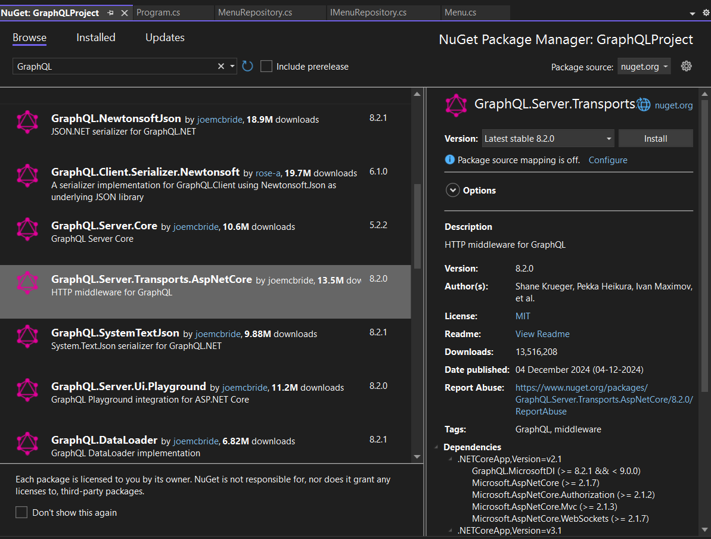
  - Install GraphQL.Server.Transports.AspNetCore package
  - We will also install GraphiQL package. This package transforms our web browser into a graphical playground. 
  - Helps to test our GraphQL endpoints for the web browser.
  - Please note GraphQL doesnot understand our model classes. Instead it understands types, so our GraphQL endpoints need to return data based on these types.
  - We must establish mapping between our Model Classes and GraphQL types.
  - This can be done as follows. Lets say we have the following Model Class :
  ```c#
  public class Menu
  {
    public int Id { get; set; }
    public string Name { get; set; }
    public string Description { get; set; }
    public double Price { get; set; }
  }

  ```
  - Now we can define a GraphQL type like this which maps from Menu Class 
```c#
 public class MenuType : ObjectGraphType<Menu>
{
    public MenuType()
    {
        Field(x => x.Id);
        Field(x => x.Name);
        Field(x => x.Description);
        Field(x=>x.Price);
    }
}

```
- In case we have more than model class, we need to setup GraphQL types for each of the additional classes.

### Working with GraphQL queries
- Here is the mapping between GraphQL datatypes and c# data type 
```c#
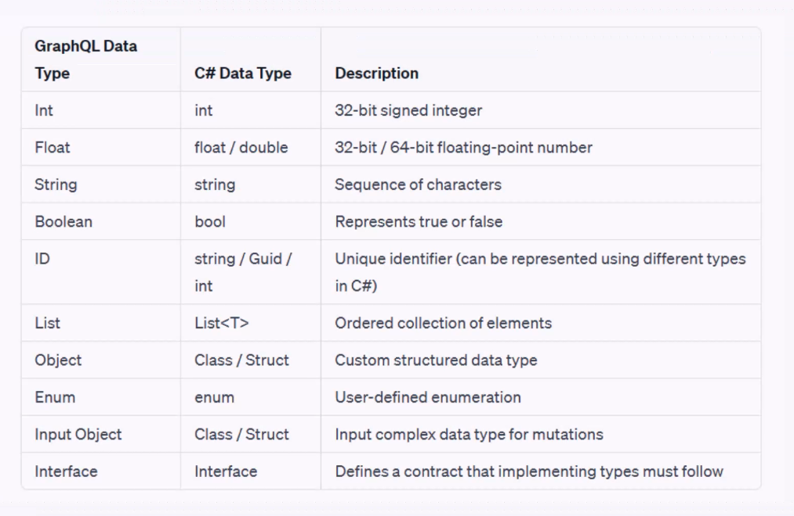

```
- Graph QL queries can be written like this 
```c#
 public class MenuQuery : ObjectGraphType
{
    public MenuQuery(IMenuRepository menuRepository)
    {
        Field<ListGraphType<MenuType>>("Menus").Resolve(context =>
        {
            return menuRepository.GetAllMenus();
        });
        Field<MenuType>("Menu").Arguments(new QueryArguments(new QueryArgument<IntGraphType> {Name = "menuId" })).Resolve(context =>
        {
            return menuRepository.GetMenuById(context.GetArgument<int>("menuId"));
        });
    }
    
}


```

### GraphQL schemas 
- In GraphQL schema we have queries and mutations. 
- We need to resolve queries in GraphQL schema
- We can register our GraphQL queries within the schema like this 
```c#
 public class MenuSchema: GraphQL.Types.Schema
{
    public MenuSchema(MenuQuery menuQuery)
    {
        Query = menuQuery;
    }
}


```
### Registering GraphQL in Program.cs 
- This can be done as follows:
```c#
 builder.Services.AddControllers();
builder.Services.AddTransient<IMenuRepository,MenuRepository>();
builder.Services.AddTransient<MenuType>();
builder.Services.AddTransient<MenuQuery>();
builder.Services.AddTransient<ISchema, MenuSchema>();
//Autogenerate the schema based on specified schema interface or type
//Also we want the response in JSON format.
builder.Services.AddGraphQL(b => b.AddAutoSchema<ISchema>().AddSystemTextJson());

```
- We also need to define a graphical playground middleware to our request pipeline. Here we will pass the path that will be used to open the GraphQL playground for playing GraphQL queries inside our browser. 
- Consider the GraphQL path like a route URL .
- 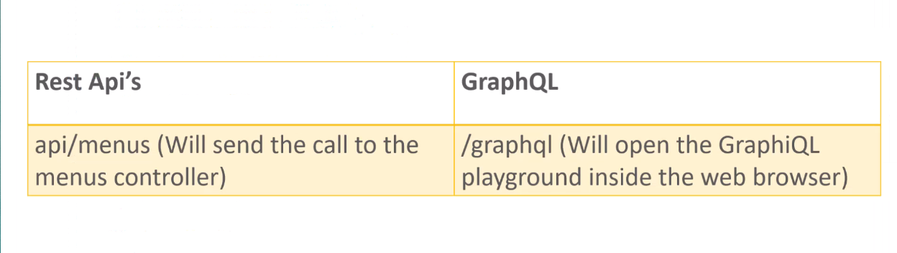
```c#
 //Here on this path the graphical playground is opened
  app.UseGraphiQl("/graphql");
  app.UseGraphQL<ISchema>();

```
- 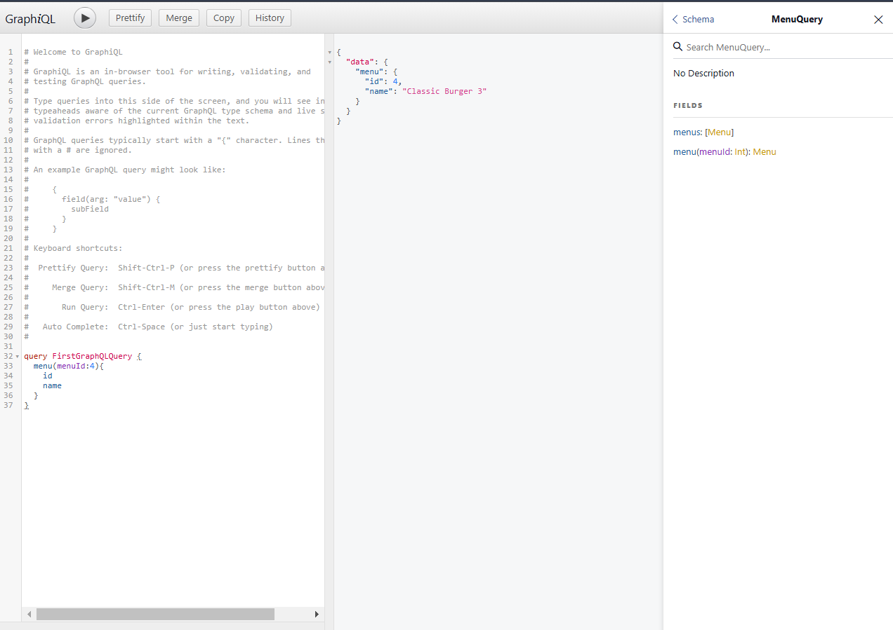

### GraphQL Mutations
- Since add Menu will contain an input of type menu we need to define a menu input type as follows: 
```c#

 public class MenuInputType: InputObjectGraphType
{
    public MenuInputType()
    {
        Field<IntGraphType>("id");
        Field<StringGraphType>("name");
        Field<StringGraphType>("description");
        Field<FloatGraphType>("price"); 

    }
}

```
- Now we need to define a class called MenuMutations 
  ```c#
   public class MenuMutation : ObjectGraphType
  {
    public MenuMutation(IMenuRepository menuRepository) 
     {
        Field<MenuType>("CreateMenu").Arguments(new QueryArguments(new QueryArgument<MenuInputType> { Name = "menu" })).Resolve(context =>
        {
            return menuRepository.AddMenu(context.GetArgument<Menu>("menu"));
        });

        Field<MenuType>("UpdateMenu").Arguments(new QueryArguments(new QueryArgument<IntGraphType> { Name = "menuId" }, new QueryArgument<MenuInputType> { Name = "menu" })).Resolve(context =>
        {
            return menuRepository.UpdateMenu(context.GetArgument<int>("menuId"),context.GetArgument<Menu>("menu"));
        });

        Field<BooleanGraphType>("DeleteMenu").Arguments(new QueryArguments(new QueryArgument<IntGraphType> { Name = "menuId" })).Resolve(context =>
        {
             menuRepository.DeleteMenu(context.GetArgument<int>("menuId"));
             return true;
        });


      }
  }


  ```
  - Now we need to register these mutations in the MenuSchema like this 
  ```c#
  public class MenuSchema: GraphQL.Types.Schema
  {
    public MenuSchema(MenuQuery menuQuery, MenuMutation menuMutation)
    {
        Query = menuQuery;
        Mutation = menuMutation;
    }
  }


  ```
  - Finally we need to register all this in the Program.cs file like this 
  ```c#
  builder.Services.AddTransient<IMenuRepository,MenuRepository>();
  builder.Services.AddTransient<MenuType>();
  builder.Services.AddTransient<MenuQuery>();
  builder.Services.AddTransient<MenuMutation>();
  builder.Services.AddTransient<MenuInputType>();
  builder.Services.AddTransient<ISchema, MenuSchema>();
  builder.Services.AddGraphQL(b => b.AddAutoSchema<ISchema>().AddSystemTextJson());

  ```
  - 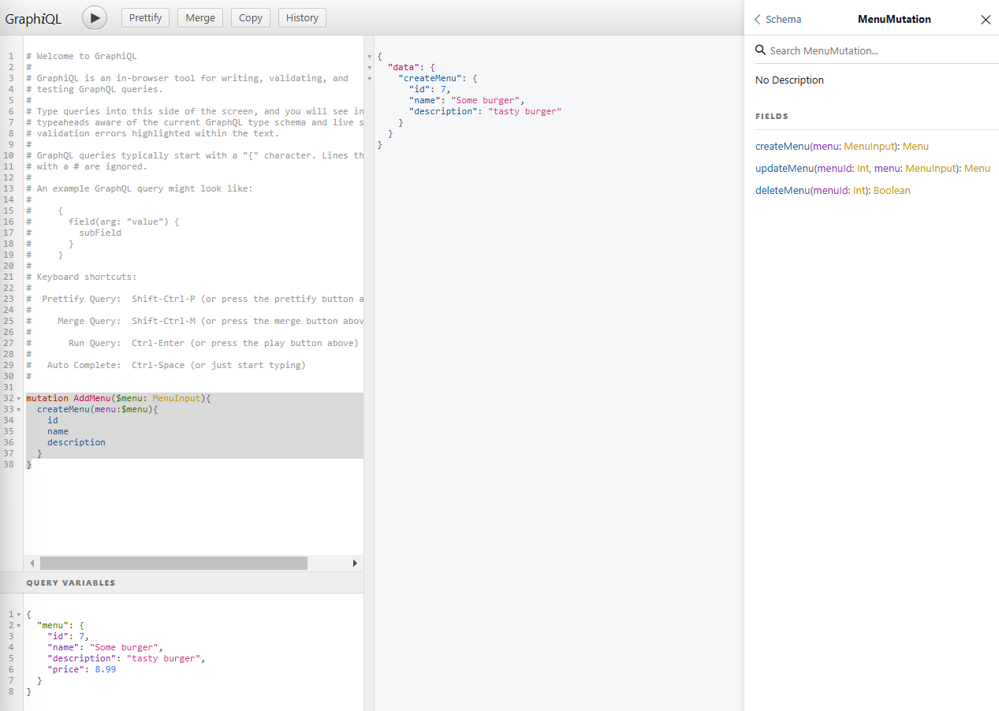
  - 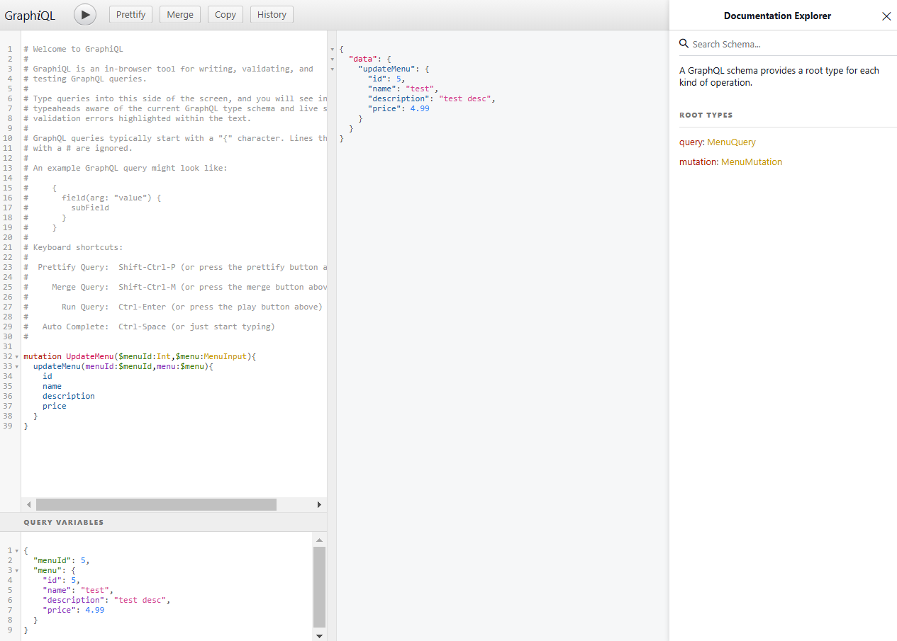
  - 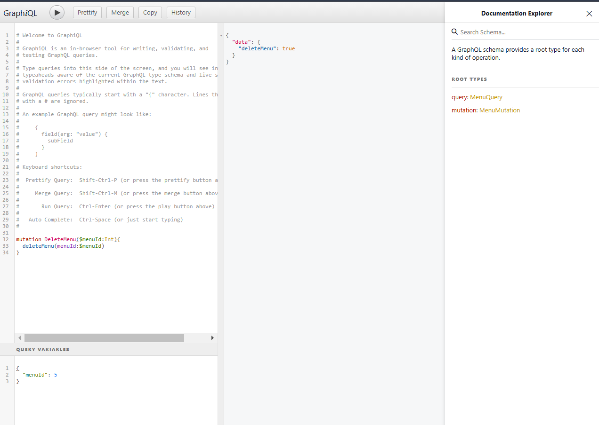

## Database Integration. 
- We can define a GraphQL DbContext as follows:
```c#
public class GraphQLDBContext : DbContext
{
    //this options helps to provide connection string and other database configurations
    public GraphQLDBContext(DbContextOptions<GraphQLDBContext> options):base(options) 
    {

    }

    public DbSet<Menu> Menus { get; set; }
    public DbSet<Category> Categories { get; set; }

    public DbSet<Reservation> Reservations { get; set; }

    protected override void OnModelCreating(ModelBuilder modelBuilder)
    {
        base.OnModelCreating(modelBuilder);
        modelBuilder.Entity<Category>().HasData(
          new Category { Id = 1, Name = "Appetizers", ImageUrl = "https://example.com/categories/appetizers.jpg" },
          new Category { Id = 2, Name = "Main Course", ImageUrl = "https://example.com/categories/main-course.jpg" },
          new Category { Id = 3, Name = "Desserts", ImageUrl = "https://example.com/categories/desserts.jpg" }
       );

        modelBuilder.Entity<Menu>().HasData(
           new Menu { Id = 1, Name = "Chicken Wings", Description = "Spicy chicken wings served with blue cheese dip.", Price = 9.99, ImageUrl = "https://example.com/menus/chicken-wings.jpg", CategoryId = 1 },
           new Menu { Id = 2, Name = "Steak", Description = "Grilled steak with mashed potatoes and vegetables.", Price = 24.50, ImageUrl = "https://example.com/menus/steak.jpg", CategoryId = 2 },
           new Menu { Id = 3, Name = "Chocolate Cake", Description = "Decadent chocolate cake with a scoop of vanilla ice cream.", Price = 6.95, ImageUrl = "https://example.com/menus/chocolate-cake.jpg", CategoryId = 3 }
        );

        modelBuilder.Entity<Reservation>().HasData(
           new Reservation { Id = 1, CustomerName = "John Doe", PhoneNumber = "555-123-4567", PartySize = 2, SpecialRequest = "No nuts in the dishes, please.", ReservationDate = DateTime.Now.AddDays(7) },
           new Reservation { Id = 2, CustomerName = "Jane Smith", PhoneNumber = "555-987-6543", PartySize = 4, SpecialRequest = "Gluten-free options required.", ReservationDate = DateTime.Now.AddDays(10) },
           new Reservation { Id = 3, CustomerName = "Michael Johnson", PhoneNumber = "555-789-0123", PartySize = 6, SpecialRequest = "Celebrating a birthday.", ReservationDate = DateTime.Now.AddDays(14) }
       );
    }
}

```
- We can define Interfaces and Repositories for Menus, Categories and Reservations like this 
```c#
  public class CategoryRepository(GraphQLDBContext dbContext) : ICategoryRepository
 { 
     public async Task<Category> AddCategory(Category category)
     {
         dbContext.Categories.Add(category);
          await  dbContext.SaveChangesAsync();
         return category;
     }

     public async Task DeleteCategory(int id)
     {
         var category = dbContext.Categories.FirstOrDefault(c => c.Id == id);
         dbContext.Categories.Remove(category);
         await dbContext.SaveChangesAsync();
     }

     public async Task<List<Category>> GetAllCategories()
     {
         return await dbContext.Categories.ToListAsync();
     }

     public async Task<Category> UpdateCategory(int id, Category category)
     {
         var foundCategory = await dbContext.Categories.FirstOrDefaultAsync(c => c.Id == id);
         foundCategory.Name = category.Name;
         foundCategory.ImageUrl = category.ImageUrl;
         //foundCategory.Menus = category.Menus;
         await dbContext.SaveChangesAsync();
         return foundCategory;
     }
 }


```
- Instead of using MenuSchema, we define a RootSchema with RootQuery and RootMutation as follows :

```c#
  public class RootSchema : GraphQL.Types.Schema
 {
     public RootSchema(IServiceProvider serviceProvider):base(serviceProvider) 
     {
         Query = serviceProvider.GetRequiredService<RootQuery>();   
         Mutation = serviceProvider.GetRequiredService<RootMutation>();
     }
   
 }

 public class RootMutation : ObjectGraphType
{
    public RootMutation()
    {
        Field<MenuMutation>("menuMutation").Resolve(context => new { });
        Field<CategoryMutation>("categoryMutation").Resolve(context => new { });
        Field<ReservationMutation>("reservationMutation").Resolve(context => new { });
    }
}

 public class RootQuery : ObjectGraphType
 {
     public RootQuery()
     {
         Field<MenuQuery>("menuQuery").Resolve(context => new { });
         Field<CategoryQuery>("categoryQuery").Resolve(context => new { });
         Field<ReservationQuery>("reservationQuery").Resolve(context => new { });
     }
 }


```
- Similar to MenuInputType we have CategoryInputType and ReservationInputType 
```c#
public class CategoryInputType: InputObjectGraphType
{
    public CategoryInputType()
    {
        Field<IntGraphType>("id");
        Field<StringGraphType>("name");
        Field<StringGraphType>("imageurl");
    }
}

 public class ReservationInputType: InputObjectGraphType
 {
     public ReservationInputType()
     {
         Field<IntGraphType>("id");
         Field<StringGraphType>("customerName");
         Field<StringGraphType>("phoneNumber");
         Field<IntGraphType>("partySize");
         Field<StringGraphType>("specialRequest");
         Field<DateGraphType>("reservationDate");
     }
 }

```
- To map Category Model and Reservation Model to our GraphQL types we can do this 
```c#
 public class CategoryType : ObjectGraphType<Category>
{
    public CategoryType(IMenuRepository menuRepository)
    {
        Field(x => x.Id);
        Field(x => x.Name);
        Field(x => x.ImageUrl);
        //Field(x => x.Menus);
        Field<ListGraphType<MenuType>>("Menus").Resolve(context =>
        {
            return menuRepository.GetAllMenus().GetAwaiter().GetResult();
        });

    }
}

 public class ReservationType: ObjectGraphType<Reservation>
 {
     public ReservationType()
     {
         Field(x => x.CustomerName);
         Field(x => x.PhoneNumber);
         Field(x => x.PartySize);
         Field(x => x.Id);
         Field(x => x.SpecialRequest);
         Field(x => x.ReservationDate);
     }
 }


```
- We need to register everything in Program.cs file like this 
```c#
 
//Register GraphQL Types
builder.Services.AddTransient<MenuType>();
builder.Services.AddTransient<CategoryType>();
builder.Services.AddTransient<ReservationType>();
//Register GraphQL Queries
builder.Services.AddTransient<MenuQuery>();
builder.Services.AddTransient<CategoryQuery>();
builder.Services.AddTransient<ReservationQuery>();
builder.Services.AddTransient<RootQuery>();
//Register GraphQL Mutations
builder.Services.AddTransient<MenuMutation>();
builder.Services.AddTransient<CategoryMutation>();
builder.Services.AddTransient<ReservationMutation>();
builder.Services.AddTransient<RootMutation>();
//Register GraphQL InputTypes
builder.Services.AddTransient<MenuInputType>();
builder.Services.AddTransient<CategoryInputType>();
builder.Services.AddTransient<ReservationInputType>();
//Register GraphQL Schemas
//builder.Services.AddTransient<ISchema, MenuSchema>();
builder.Services.AddTransient<ISchema, RootSchema>();


builder.Services.AddGraphQL(b => b.AddAutoSchema<ISchema>().AddSystemTextJson());
builder.Services.AddDbContext<GraphQLDBContext>(options =>
{
    options.UseSqlServer(builder.Configuration.GetConnectionString("GraphQLDbContextConnection"));
    options.ConfigureWarnings(warnings =>

            warnings.Ignore(RelationalEventId.PendingModelChangesWarning));
});


```
- To test our mutations we can do this 
- 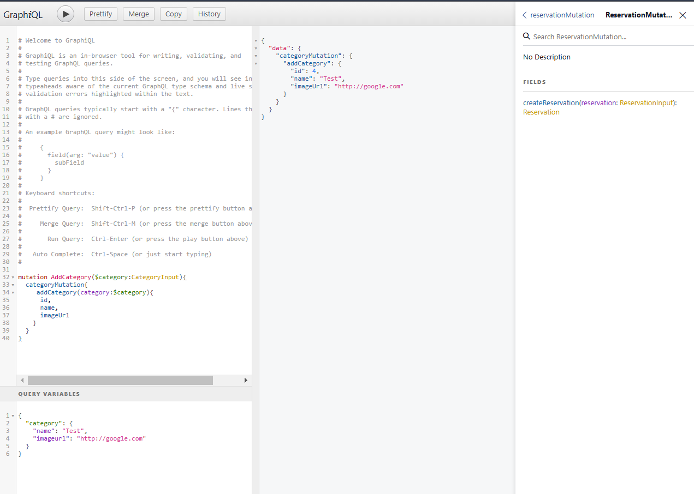
- 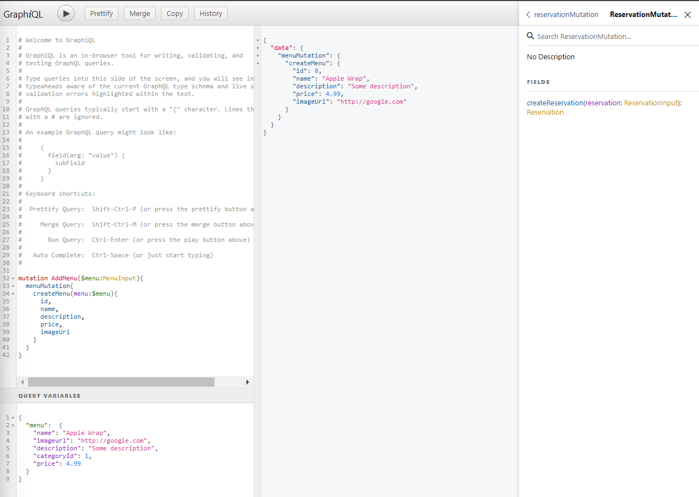
- 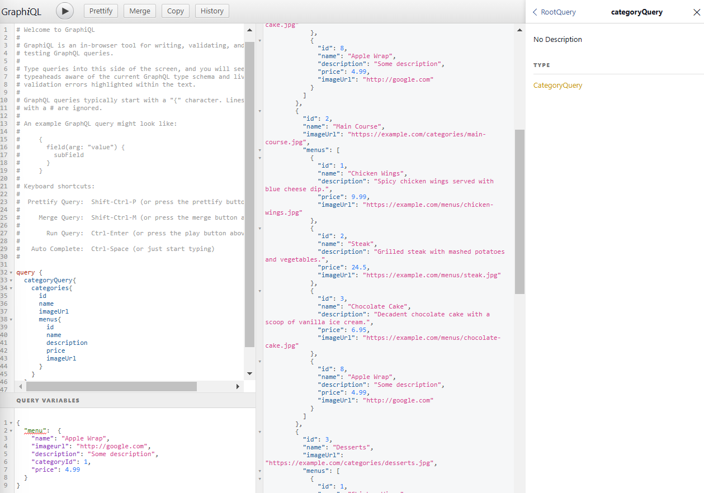
- 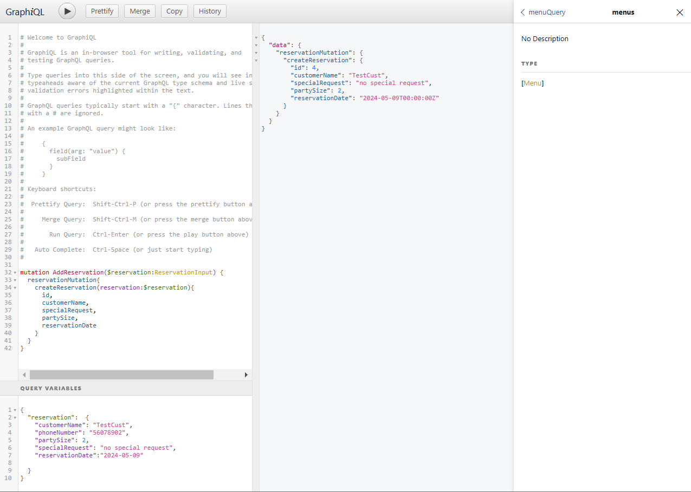
- 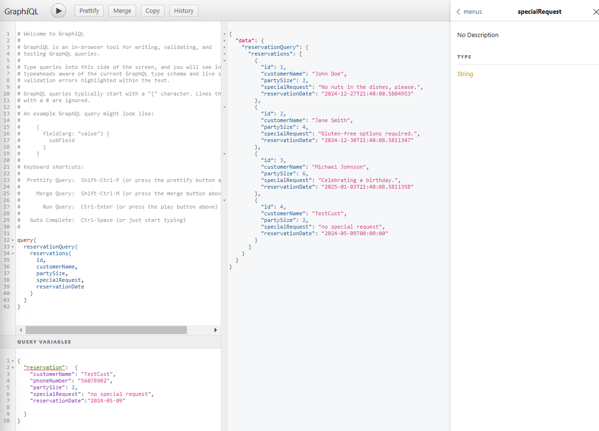

- In GraphQL, the concepts of RootSchema, RootQuery, and RootMutation are fundamental to defining the structure and capabilities of your API. 
- Here’s a breakdown of each:
**RootSchema**
- The Root Schema is the top-level schema that defines the entry point of your GraphQL API. It specifies the available queries, mutations, and subscriptions. 
- Essentially, the schema outlines the structure and type definitions for your entire GraphQL service.
```c#
  schema {
  query: RootQuery
  mutation: RootMutation
  }


```
- In this example, the schema includes both RootQuery and RootMutation, indicating that your API supports both queries and mutations.

**Root Query**
- The Root Query type is the entry point for all read operations. It defines the queries that clients can execute to fetch data. 
- Each field within the RootQuery represents a different way to fetch data from the API.

```c#
 type RootQuery {
  user(id: ID!): User
  users: [User]
}

type User {
  id: ID!
  name: String
  email: String
}


```
- In this example, RootQuery has two fields: user, which fetches a single user by ID, and users, which fetches a list of all users.

**Root Mutation**
- The Root Mutation type is the entry point for all write operations. It defines the mutations (changes to data) that clients can execute. 
- Each field within the RootMutation represents a different operation that modifies data.
```c#
 type RootMutation {
  createUser(name: String!, email: String!): User
  deleteUser(id: ID!): User
}

type User {
  id: ID!
  name: String
  email: String
}


```
- In this example, RootMutation has two fields: createUser, which allows creating a new user, and deleteUser, which allows deleting a user by ID.

 ### why use GraphQL
- GraphQL offers several advantages over traditional REST APIs, making it a popular choice for many developers and organizations. Here are some compelling reasons to use GraphQL:

1. **Efficient Data Retrieval**
With GraphQL, clients can request exactly the data they need and nothing more. This helps reduce over-fetching and under-fetching of data, leading to more efficient use of network resources.

2. **Single Endpoint**
GraphQL provides a single endpoint for querying all data. This simplifies API management and reduces the complexity of endpoint management found in REST APIs.

3. **Flexible Queries**
GraphQL allows clients to specify their own query structure, enabling them to request multiple resources in a single query. This flexibility reduces the number of API calls required to fetch related data.

4. **Strongly Typed Schema**
GraphQL schemas are strongly typed, providing clear and explicit definitions of the data and operations available. This helps with documentation, tooling, and debugging.

5. R**eal-time Data with Subscriptions**
GraphQL supports subscriptions, allowing clients to receive real-time updates when data changes. This is useful for applications that require live data, such as chat apps or dashboards.

6. **Better Developer Experience**
With tools like GraphiQL and Apollo Client, developers have access to powerful tools for exploring, querying, and managing GraphQL APIs. This leads to a better development and debugging experience.

7. **Interoperability**
GraphQL can be used with any programming language and works well with various data sources, including databases, microservices, and third-party APIs.
  
### Practical Example
Imagine you have an application that needs user data along with their recent orders. With REST, you might need to make multiple requests to different endpoints.
 With GraphQL, you can fetch all this information in a single request:
 ```c#
 {
  user(id: "1") {
    name
    email
    recentOrders {
      id
      total
      date
    }
  }
}


 ```
## Using GraphQL with C# is a powerful way to create flexible and efficient APIs. There are several libraries that make it easy to implement GraphQL in a C# application, one of the most popular being GraphQL.NET.

1. **Install Dependencies**
First, you need to add the necessary packages to your project. 
You can install GraphQL.NET and the necessary middleware using NuGet:

```shell
dotnet add package GraphQL
dotnet add package GraphQL.Server.Transports.AspNetCore
dotnet add package GraphQL.Server.Transports.AspNetCore.SystemTextJson
dotnet add package GraphQL.Server.Ui.Playground


```

2. Define Your Schema
- Create your GraphQL schema, types, and queries. Here’s an example:
```c#
 public class UserType : ObjectGraphType<User>
{
    public UserType()
    {
        Field(x => x.Id).Description("The ID of the user.");
        Field(x => x.Name).Description("The name of the user.");
        Field(x => x.Email).Description("The email of the user.");
    }
}


```

3. Define Query
```c#
 public class UserQuery : ObjectGraphType
{
    public UserQuery(IUserRepository userRepository)
    {
        Field<ListGraphType<UserType>>(
            "users",
            resolve: context => userRepository.GetAllUsers()
        );

        Field<UserType>(
            "user",
            arguments: new QueryArguments(new QueryArgument<NonNullGraphType<IntGraphType>> { Name = "id" }),
            resolve: context => userRepository.GetUserById(context.GetArgument<int>("id"))
        );
    }
}


```

4. Set Up the Schema and Dependency Injection
- Set Up the Schema and Dependency Injection
```c#
 public void ConfigureServices(IServiceCollection services)
{
    services.AddScoped<IUserRepository, UserRepository>();
    services.AddScoped<UserType>();
    services.AddScoped<UserQuery>();

    services.AddScoped<ISchema, UserSchema>(sp => new UserSchema(new SelfActivatingServiceProvider(sp)));

    services.AddGraphQL(options =>
    {
        options.EnableMetrics = false;
    })
    .AddSystemTextJson()
    .AddGraphTypes(ServiceLifetime.Scoped);

    services.AddControllers();
}


```
- Configure Middleware 
```c#
 public void Configure(IApplicationBuilder app, IWebHostEnvironment env)
{
    if (env.IsDevelopment())
    {
        app.UseDeveloperExceptionPage();
    }

    app.UseGraphQL<ISchema>();
    app.UseGraphQLPlayground(options: new GraphQLPlaygroundOptions());

    app.UseRouting();
    app.UseEndpoints(endpoints =>
    {
        endpoints.MapControllers();
    });
}


```
5. Define your schema 
- using graphQL with c#
Using GraphQL with C# is a powerful way to create flexible and efficient APIs. There are several libraries that make it easy to implement GraphQL in a C# application, one of the most popular being GraphQL.NET. Here’s a step-by-step guide to get you started:

1. Install Dependencies
First, you need to add the necessary packages to your project. You can install GraphQL.NET and the necessary middleware using NuGet:

shell
dotnet add package GraphQL
dotnet add package GraphQL.Server.Transports.AspNetCore
dotnet add package GraphQL.Server.Transports.AspNetCore.SystemTextJson
dotnet add package GraphQL.Server.Ui.Playground
2. Define Your Schema
Create your GraphQL schema, types, and queries. Here’s an example:

Define Types:

csharp
public class UserType : ObjectGraphType<User>
{
    public UserType()
    {
        Field(x => x.Id).Description("The ID of the user.");
        Field(x => x.Name).Description("The name of the user.");
        Field(x => x.Email).Description("The email of the user.");
    }
}
Define Query:

csharp
public class UserQuery : ObjectGraphType
{
    public UserQuery(IUserRepository userRepository)
    {
        Field<ListGraphType<UserType>>(
            "users",
            resolve: context => userRepository.GetAllUsers()
        );

        Field<UserType>(
            "user",
            arguments: new QueryArguments(new QueryArgument<NonNullGraphType<IntGraphType>> { Name = "id" }),
            resolve: context => userRepository.GetUserById(context.GetArgument<int>("id"))
        );
    }
}
3. Set Up the Schema and Dependency Injection
Configure your Startup.cs to set up the GraphQL schema and middleware.

Configure Services:

csharp
public void ConfigureServices(IServiceCollection services)
{
    services.AddScoped<IUserRepository, UserRepository>();
    services.AddScoped<UserType>();
    services.AddScoped<UserQuery>();

    services.AddScoped<ISchema, UserSchema>(sp => new UserSchema(new SelfActivatingServiceProvider(sp)));

    services.AddGraphQL(options =>
    {
        options.EnableMetrics = false;
    })
    .AddSystemTextJson()
    .AddGraphTypes(ServiceLifetime.Scoped);

    services.AddControllers();
}
Configure Middleware:

csharp
public void Configure(IApplicationBuilder app, IWebHostEnvironment env)
{
    if (env.IsDevelopment())
    {
        app.UseDeveloperExceptionPage();
    }

    app.UseGraphQL<ISchema>();
    app.UseGraphQLPlayground(options: new GraphQLPlaygroundOptions());

    app.UseRouting();
    app.UseEndpoints(endpoints =>
    {
        endpoints.MapControllers();
    });
}
4. Define Your Schema Class
- Define the GraphQL schema class that ties everything together.
```c#
 public class UserSchema : Schema
{
    public UserSchema(IServiceProvider provider) : base(provider)
    {
        Query = provider.GetRequiredService<UserQuery>();
    }
}


```